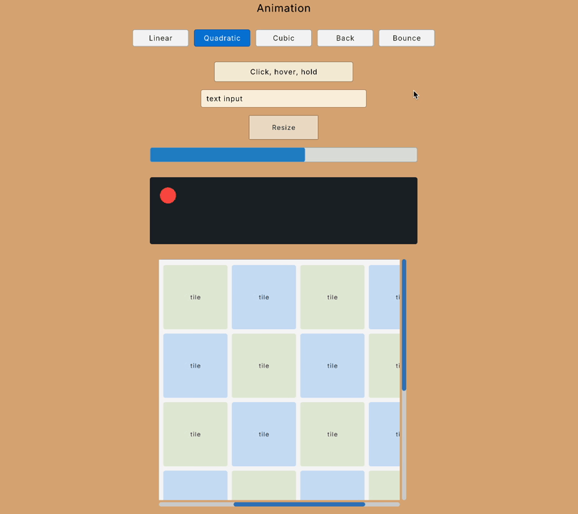
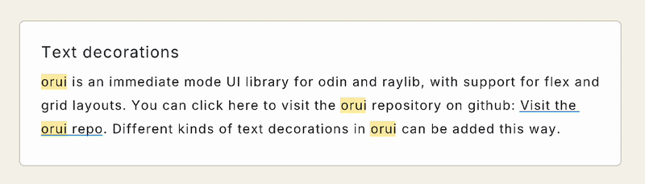

# orui


orui is an immediate mode UI library for odin and raylib, with support for flex and grid layouts.

**Requires odin 2026-03 release or newer!**





Features:

- Flex layout
  - Fit (shrink) and grow
  - Justify and align
  - Child gap
  - Flex wrap (horizontal wrap only)
- Grid layout
  - Auto rows/columns
  - Fixed rows/columns
  - Flow direction
  - Column/row gaps, spans, sizes
- Absolute, relative and fixed positioning
- Layers (z-index)
- Padding, margin, borders, rounded corners, overflow, clipping
- Scroll (with mouse wheel)
  - Horizontal/vertical scrollbars
  - Virtualized fixed-size lists and grids
- Images (textures)
  - Alignment
  - Content fit (fill, contain, cover, none, scale-down)
- Text
  - Line height, letter spacing, wrapping, alignment
- Text inputs
  - Single line and multi line
  - Click, move with arrow keys, home+end, insert, backspace, select all
  - Double click, triple click
  - Mouse and keyboard text selection
  - Copy/cut/paste
  - Undo/redo
- Custom render events
  - Interleave your own rendering with the UI
- Pointer routing through element subtrees
  - Non-visual hit slop for thin interaction targets
- Drag and drop sources and geometric drop targets
- Fixed-pitch sortable horizontal and vertical axes
- Resizable element edges and corners
- Cursor
- Animation helpers

To do:

- 9-slice scaling
- Grid justify/align
- Text inputs
  - Character filtering
  - Drag and drop (maybe)
  - Placeholder (maybe)
  - Customise text select background colour
- Other widgets (maybe)
  - Slider
- Grid row/column start (maybe)
- Scroll with drag
- Scroll momentum
- Scroll bounce

## Table of Contents

- [Usage](#usage)
- [Declaring UI](#declaring-ui)
  - [element](#elementid-config-modifiers)
  - [container](#containerid-config-modifiers)
  - [label](#labelid-text-config-modifiers)
  - [text_input](#text_inputid-buffer-config-modifiers)
  - [image](#imageid-config-modifiers)
  - [scrollbar](#scrollbarparent_id-options-track_config-thumb_config)
  - [virtual_axis and virtual_grid](#virtual_axis-and-virtual_grid)
- [Other functions](#other-functions)
	- [pointer_response()](#pointer_response)
	- [pointer_position()](#pointer_position)
	- [drag_source(), drag_response(), and drop_target()](#drag_source-drag_response-and-drop_target)
	- [sortable_item() and sortable_axis()](#sortable_item-and-sortable_axis)
	- [cursor and request_cursor()](#cursor-and-request_cursor)
	- [focused()](#focused)
	- [request_focus(), clear_focus()](#request_focus-clear_focus)
	- [move_focus()](#move_focus)
	- [set_hit_slop()](#set_hit_slop)
	- [resizable()](#resizable)
- [Animation](#animation)
- [Element config](#element-config)
  - [Config helpers](#config-helpers)
  - [Config modifiers](#config-modifiers)
- [Custom render events](#custom-render-events)

## Usage

Allocate the orui Context up front and initialize:

When using Raylib input, create its window before initializing ORUI so native input hooks bind
to the correct window. `begin_with_input` can be used without a window.

```odin
ctx := new(orui.Context)
orui.init(ctx)
defer orui.destroy(ctx)
```

(Optional) Set a default font:

```odin
ctx.default_font = rl.GetFontDefault()
```

If you don't set a default font, you must pass a font to each element that displays text. The default font is a fallback for when the element font is missing.

In your render loop:

```odin
for !rl.WindowShouldClose() {
	rl.BeginDrawing()
	orui.begin(ctx, width, height)

	// Declare UI here

	render_commands := orui.end()

	for render_command in render_commands {
		// optional: use orui's built-in helper
		orui.render_command(render_command)
		// important: the built-in renderer uses the temp allocator when rendering strings!
		// remember to free the temp allocator at the end of each frame
	}

	rl.EndDrawing()
}
```

## Declaring UI

### Element IDs

Every element should have a unique ID. You can create the ID in 3 ways:

```odin
// String:
orui.id("container") // String literals will be hashed at compile time.
orui.id(string_var)

// String + index:
orui.id("row", i)

// Int (fastest, no hashing):
orui.id(1000000)
```

`orui.id` should ALWAYS be called inside element declarations, because it has side effects. If you only want to generate an ID, use `to_id` instead:

```odin
orui.to_id("row", i)
```

### element(id, config, ..modifiers)

`element` is the basic building block of orui. It can be used to build anything that orui can render.

All elements declared after will be attached as children, until `end_element()` is called:

```odin
orui.element(orui.id("container"), config)

// children declared here

orui.end_element()
```

You can use this to build your own elements:

```odin
my_element :: proc(id: string) {
  orui.element(orui.id(id), {...})
  orui.label(orui.id(id, 1), ...)
  orui.end_element()
}

@(deferred_none=orui.end_element)
my_container :: proc(id: string) {
  orui.element(orui.id(id), {...})
}

{my_container("test")
  my_element("element 1")
}
```

### container(id, config, ..modifiers)

`container` is exactly like `element` except it automatically ends the element when it goes out of scope. You should not manually call `end_element()` for containers.

This means you must use curly braces to define the scope of the container:

```odin
{orui.container(orui.id("element ID"), config)
  // declare children inside curly brackets
}
```

Or if you prefer another style:
```odin
if (orui.container(orui.id("element ID"), config)) {
  // declare children
}
```

Make sure containers always have their own scope. In the following example, label 2's parent is container B, not container A.

```odin
{
  orui.container(orui.id("container A"), config)
  orui.label(orui.id("label 1"), label1, {}) // child of container A
  orui.container(orui.id("container B"), config) // new container is child of container A
  // all elements from here to end of scope will be children of container B
  orui.label(orui.id("label 2"), label1, {}) // child of container B
}
```

### label(id, text, config, ...modifiers)

A label element displays text.

Text will wrap by default. Set the `overflow` option if you want change this behaviour.

Make sure you define the font and font size in the element config.
If the font is not defined, it will fallback to the `default_font` on the orui context.

This element does not need the surrounding curly braces because it cannot hold child elements.

```odin
orui.label(orui.id("label"), "Hello world!", {
	font = &your_font,
	font_size = 16,
})
```

A label element can also be used as a button by changing its style when the user interacts with it:

```odin
button_id := orui.to_id("button")
response := orui.pointer_response(button_id)
if orui.label(orui.id(button_id), "Button text", {
  background_color = .Held in response ? {100, 100, 100, 255} : .Hovered in response ? {120, 120, 120, 255} : {30, 30, 30, 255},
}) {
  // handle button click
}
```

### text_input(id, buffer, config, ...modifiers)

This element displays text, and also allows the user to click into it to focus on it, and edit the text.

A blinking caret is drawn using the element's `color`.

You must define a [`strings.Builder`](https://pkg.odin-lang.org/core/strings/#Builder) to hold the user input.

Text inputs can be single-line:

```odin
orui.text_input(orui.id("input"), &buffer, {
	overflow = .Visible,
	clip = {.Intersect, {}},
	scroll = orui.scroll(.Horizontal),
})
```

Or multi-line:

```odin
orui.text_input(orui.id("input"), &buffer, {
	overflow = .Wrap,
	scroll = orui.scroll(.Vertical),
})
```

For single-line text inputs, the Enter key will unfocus the input.

For multi-line text inputs, the Enter key will add a new line to the text.

You can use the `focused()` function to change styles when the element is focused.

```odin
orui.text_input(orui.id("input"), &buffer, {
	background_color = orui.focused() ? rl.WHITE : rl.LIGHTGRAY,
})
```

### image(id, config, ...modifiers)

Display an image. Takes a pointer to a raylib Texture2D.

This element does not need the surrounding curly braces because it cannot hold child elements.

```odin
orui.image(orui.id("image"), &texture, {
	color = rl.WHITE, // optional tint
	texture_source = rl.Rectangle{}, // optional, draw part of the texture
	texture_fit = .Contain,
	align = .Center,
})
```

### scrollbar(parent_id, options, track_config, thumb_config)

Attach a scrollbar to a scrolling container. The parent remains the source of truth for its
viewport, content extent, and scroll offset; callers only choose scrollbar policy and visuals.

- `parent_id`: ID of the scrolling container.
- `options.axis`: `.Vertical` or `.Horizontal`. The axis is also part of the generated track and
  thumb IDs, so a parent can have one scrollbar on each axis without numeric indices.
- `options.visibility`: `.When_Needed` (default), `.Always`, or `.Hidden`.
- `options.track_click`: `.None` (default), `.Jump`, or `.Page`.
- `options.min_thumb_extent`: minimum thumb length. `0` uses
  `SCROLL_BAR_DEFAULT_MIN_THUMB_EXTENT`.
- `options.hit_extent`: total cross-axis interaction width. This can be wider than the visible
  track without changing layout or rendering.
- `track_config`: visual and layout configuration for the track.
- `thumb_config`: visual configuration for the thumb. ORUI owns its main-axis size and position.

Declare the scrollbar after its parent and inside the same positioned container. An absolute track
with `placement` can overlay content; normal flex/grid layout can reserve space for a solid bar.
Visibility hides rendering and interaction, not layout size, so a hidden in-flow bar keeps its slot.

For horizontal scrollbars, set the thumb height. For vertical scrollbars, set the thumb width.

Dragging preserves the pointer's grab offset within the thumb. Track presses follow the selected
policy, and the scroll offset is clamped to the parent container's measured range. `.Page` repeats
while held after a short delay and stops when the thumb reaches the pointer.

```odin
orui.scrollbar(
  orui.to_id("container id"),
  {
    axis = .Vertical,
    visibility = .When_Needed,
    track_click = .Jump,
    min_thumb_extent = orui.SCROLL_BAR_DEFAULT_MIN_THUMB_EXTENT,
    hit_extent = 14,
  },
  {
    position = {.Absolute, {-5, 0}},
    placement = placement(.Right, .Right),
    width = orui.fixed(6),
    height = orui.percent(0.9),
    corner_radius = corner(4),
    background_color = rl.BLACK,
  },
  {
    width = orui.percent(1),
    background_color = rl.LIGHTGRAY,
    corner_radius = corner(4),
  },
)
```

### virtual_axis and virtual_grid

Use `virtual_axis` to declare only visible items from a fixed-size horizontal or vertical list. It creates the scroll container and full-size content element. Keep it in its own scope, iterate over `[range.first:range.last]`, and position each item with `virtual_axis_item`.

```odin
list_id := orui.to_id("rows")
{range := orui.virtual_axis(
		list_id,
		len(rows),
		32,
		4,
		.TopToBottom,
		{width = orui.grow(), height = orui.fixed(320)},
	)
	for text, offset in rows[range.first:range.last] {
		index := range.first + offset
		config := orui.ElementConfig{}
		orui.virtual_axis_item(range, index, &config)
		orui.label(orui.id("row", index), text, config)
	}
}
```

`virtual_grid` calculates the number of columns from the available width. Use `grid.first:grid.last` and `virtual_grid_item` the same way:

```odin
{grid := orui.virtual_grid(
		orui.to_id("cards"),
		len(cards),
		160,
		120,
		8,
		{width = orui.grow(), height = orui.grow()},
	)
	for card, offset in cards[grid.first:grid.last] {
		index := grid.first + offset
		config := orui.ElementConfig{}
		orui.virtual_grid_item(grid, index, &config)
		draw_card(card, config)
	}
}
```

## Other functions

### pointer_response()

Returns the routed pointer state for an element ID and its descendants:

```odin
response := orui.pointer_response(label_id)
if .Pressed in response {
	// label or a descendant received the press
}
if .Held in response {
	// the same interaction is still owned, even outside its bounds
}
if .Clicked in response {
	// the owning button was released back inside
}
```

The response flags are `Hovered`, `Pressed`, `Held`, `Released`, and `Clicked`. Pass a mouse button as the second argument when querying non-left interactions. Only one initiating button owns an interaction until it releases. While held, unrelated elements do not report ordinary hover.

### pointer_position()

Returns the pointer position from the same input snapshot used for routing:

```odin
mouse := orui.pointer_position()
```

### drag_source(), drag_response(), and drop_target()

`drag_source` registers a stable element ID as a source and returns its gesture geometry. The
default threshold is `DRAG_DEFAULT_THRESHOLD` (6 ORUI units). A drag starts only after the
Euclidean distance from the press origin is greater than the threshold, so diagonal movement is
treated consistently with horizontal and vertical movement.

```odin
drag := orui.drag_source(row_id)
if .Started in drag.flags {
	// Store caller-owned, typed payload metadata.
}
if .Dragged in drag.flags {
	ghost_position := drag.position - drag.grab_offset
}
```

The flags are `Started`, `Dragged`, `Stopped`, and `Cancelled`. `Started` and `Dragged` occur
together on the first active frame. `Stopped` is available on the release frame. Escape reports
`Cancelled`. ORUI clears the session at the end of a stopped or cancelled frame, after callers
have had an opportunity to read it.

ORUI stores only pointer lifecycle, source ID, and geometry; it does not type-erase application
payloads. Keep the payload in caller-owned typed state. `drag_response(source_id)` keeps the
gesture observable when a virtualized or conditionally declared source is absent.

Normal hover is suppressed during pointer capture. Use `drop_target` to test a target's clipped
interaction rectangle independently of hover routing:

```odin
drop := orui.drop_target(list_id, row_id)
if .Hovered in drop.flags {
	// Draw the target preview.
}
if .Dropped in drop.flags {
	// Consume the caller-owned payload.
}
```

The source ID is explicit so multiple typed payload owners cannot be confused. `pointer_contains`
exposes the same geometric test when a custom target policy needs more than `Hovered`/`Dropped`.

### sortable_item() and sortable_axis()

Use `sortable_item` for fixed-pitch rows or columns that can be reordered. Register visible items
while declaring them, then call `sortable_axis` once after the axis contents. ORUI keeps an active
source observable when virtualization stops declaring it.

```odin
orui.sortable_item(list_id, row_id, row_index)

sort := orui.sortable_axis(list_id, {
	count = row_count,
	item_extent = row_height,
	direction = .TopToBottom,
	release = .Require_Inside,
})
if sort.dropped {
	move_typed_item(sort.source_index, sort.destination_index)
}
```

Without a handle, only a press owned directly by the item can start sorting, so buttons and other
blocking descendants retain their interactions. Pass a stable handle ID as the fourth argument to
make that descendant the only valid initiator.

The response contains the generic drag lifecycle, source index, insertion slot, normalized
destination index, marker offset, and axis-locked ghost rectangle. The caller retains typed payloads
and draws the marker and ghost. `.Require_Inside` drops only inside the clipped axis;
`.Clamp_To_Axis` accepts release anywhere and clamps to an axis destination. Set
`edge_scroll_zone` and `edge_scroll_items_per_second` to enable time-based edge scrolling; the
provided `SORTABLE_AXIS_DEFAULT_*` constants are suitable defaults.

### cursor and request_cursor()

Declare the usual cursor for an element in its config:

```odin
{orui.container(orui.id("splitter"), {
	width = orui.fixed(6),
	cursor = .ResizeEW,
})}
```

`cursor` is a `Maybe(orui.Cursor)`. Its default `nil` value means the element makes no declaration, so an ancestor declaration can still apply. Set `.Default` explicitly when a child should restore the default arrow instead. Element modifiers can assign `element.cursor` in the same way.

`Cursor` includes the standard pointer, text, crosshair, and resize shapes plus native shapes such as `.TextVertical`, `.Grab`, `.Grabbing`, directional resize cursors, `.DisappearingItem`, `.DragLink`, `.DragCopy`, and `.ContextualMenu`.

Declarations apply while the element or one of its descendants is on the current pointer hover or active-owner path. A direct child declaration wins over an ancestor declaration regardless of element finalization order. An active pointer owner keeps its declared cursor while dragging outside its bounds.

Use `request_cursor` when the cursor depends on finer dynamic state that is not represented by an element, such as a custom-rendered canvas subregion:

```odin
splitter_id := orui.to_id("splitter")
orui.request_cursor(splitter_id, .ResizeEW)
```

Covered and unrelated requests are ignored. Repeated declarations or requests from the same element use the last kind, so a manual request made after the element is finalized can override its declaration for that frame.

For a custom-rendered subregion, perform the finer geometry check yourself and keep the containing ORUI element as the request owner:

```odin
if pointer_is_over_handle {
	orui.request_cursor(canvas_id, .Crosshair)
}
```

Cursor intent resets to `.Default` at the start of every frame. `end()` emits a `.Cursor` render command on the first frame and whenever the resolved cursor changes:

```odin
render_commands := orui.end()
for command in render_commands {
	orui.render_command(command)
}
```

`ElementConfig.cursor`, `request_cursor`, and `RenderCommandDataCursor.kind` use ORUI's semantic `Cursor` type. The built-in renderer uses AppKit's native cursor shapes on Darwin and maps to the closest Raylib cursor elsewhere. Custom renderers should translate the same semantic command for their platform. Repeated frames with the same resolved cursor do not emit another cursor command, so consumers must process every command returned by `end()` to stay synchronized.

Like other pointer responses, cursor eligibility uses the previous frame's resolved layout, clipping, layers, and popup routing.

### focused()

Returns true if the element currently owns keyboard focus.

Only one element can be focused at a time.

Focus is opt-in through `ElementConfig.focus`. Pointer and sequential navigation focus can be enabled independently:

```odin
button_id := orui.to_id("button")
orui.container(orui.id(button_id), {
	focus = {.Pointer, .Navigation},
})

if orui.focused(button_id) {
	// button owns keyboard focus
}
```

An empty policy is the default, so labels, icons, and layout-only containers do not enter sequential navigation. Text inputs enable both modes. Navigation order follows declaration order, skips disabled or missing elements, and wraps.

You can ask about a specific element by passing in the ID:

```odin
if orui.focused("input element") {
  // is focused
}
```

### request_focus(), clear_focus()

Request focus after declaring the target in the current frame. Missing, disabled, or non-focusable targets are ignored.

```odin
field_id := orui.to_id("field")
orui.container(orui.id(field_id), {
	focus = {.Pointer, .Navigation},
})

orui.request_focus(field_id)
orui.clear_focus()
```

### move_focus()

Moves focus through elements marked `.Navigation`. ORUI automatically handles plain Tab and Shift+Tab. Modified Tab presses remain available to application commands.

Call `move_focus` only when the application explicitly requests traversal without a Tab key event:

```odin
orui.move_focus(.Forward)
```

### set_hit_slop()

Expands pointer hit testing around an existing element without changing its layout or rendering bounds. Call after declaring the element in the current frame.

```odin
orui.set_hit_slop(panel_id, {left = 10, bottom = 10})
```

Useful for thin borders and custom handles. Hit slop only participates in ORUI hit testing and layer priority; use `resizable` for standard resize edges.

### resizable()

Turns the selected edges and corners of an existing element into resize handles. Pass a caller-owned rectangle in ORUI units and call after declaring the element:

```odin
panel_rect := rl.Rectangle{340, 170, 280, 260}

{orui.container(orui.id(panel_id), {
	position = {.Fixed, {panel_rect.x, panel_rect.y}},
	width = orui.fixed(panel_rect.width),
	height = orui.fixed(panel_rect.height),
})}

resizing := orui.resizable(
	panel_id,
	{.Left, .Bottom},
	&panel_rect,
	min_width = 180,
	min_height = 120,
)
```

`Resize_Edges` can contain `Left`, `Right`, `Top`, and `Bottom`. Corners are enabled when both adjoining edges are present and take priority over the side handles. The function returns true while a handle is hovered or actively dragged.

Left and top handles update the rectangle origin as well as its size, keeping the opposite edge fixed. Right and bottom handles leave the origin fixed. Every update is derived from the rectangle captured at drag start, so incremental rounding does not cause drift.

Minimum and maximum sizes use the same units as the rectangle; a maximum of zero means unbounded. `hit_size` is the full side-handle thickness centered on the edge, and `corner_size` is the full square size centered on a corner.

## Animation

Use `transition` when you have a boolean trigger:

```odin
button_id := orui.to_id("button")
response := orui.pointer_response(button_id)
orui.label(orui.id(button_id), "Button", {
	// background transitions from white to light gray when hovered over
	background_color = orui.transition("background", .Hovered in response, rl.WHITE, rl.LIGHTGRAY),

	// border transitions from 1px to 3px when input is active
	border = orui.transition("border", .Held in response, orui.border(1), orui.border(3)),
})
```

You can also get only the transition factor and use it for multiple values:

```odin
button_id := orui.to_id("button1")
response := orui.pointer_response(button_id)
hover_t := orui.transition("button1 hover", .Hovered in response)

orui.label(orui.id(button_id), "Button", {
	background_color = orui.lerp(rl.WHITE, rl.LIGHTGRAY, hover_t),
	padding = orui.lerp(orui.padding(8), orui.padding(12), hover_t),
})
```

`transition` is best for simple on/off animations: one trigger, one start/end value.

Use `animate` when a value has one final target, but that target might come from several states. Think of it as: choose where the value should end up, and let orui handle getting there smoothly.

This keeps multi-state styles easy. You can use normal logic to decide which state wins, then pass the final target to `animate`:

```odin
target_bg := rl.WHITE
row_id := orui.to_id("row", i)
response := orui.pointer_response(row_id)
if selected {
	target_bg = {210, 230, 255, 255}
}
if .Hovered in response {
	target_bg = rl.LIGHTGRAY
}

orui.label(orui.id(row_id), text, {
	background_color = orui.animate("background", target_bg),
})
```

You can customise the duration and easing for both `transition` and `animate`:

```odin
background_color = orui.animate("background", target_bg, 0.2, .Cubic_Out)
```

The easing is the Ease enum from odin's core:math/ease package.

Animation state is stored in the orui context and scoped to the current element ID. This means animation IDs only need to be unique inside the element where they are used.

You cannot use transition() and animate() outside of element declarations (for now).

## Element config

Each element can be configured with these fields:

### layout
```odin
Layout :: enum {
	Flex,  // Default. Automatically positions children.
	Grid,  // Position children within a grid with fixed number of columns and/or rows.
	None,  // Does not affect children positioning.
}
```

### direction

Set flex/grid layout direction.

```odin
LayoutDirection :: enum {
	LeftToRight,  // Default
	TopToBottom,
}
```

### position

```odin
PositionType :: enum {
	// Default. Positioned by flex/grid parent. Don't use this if parent is not flex or grid.
	Auto,
	// Positioned relative to the closest ancestor with a non-auto position.
	Absolute,
	// Positioned relative to its parent's position.
	// When used in a flex/grid container, it will be relative to its Auto position.
	Relative,
	// Positioned relative to the root element (the screen).
	Fixed,
}

Position :: struct {
	type:  PositionType,
	value: rl.Vector2,
}
```

### placement

Placement controls how an element is positioned relative to its anchor element.

Values are between 0 and 1 where 0,0 is the top left and 1,1 is the bottom right of the element (no matter its size).

This only applies to non-auto positioned elements.

This is useful when you want to align a particular side of an element to a particular side of its parent or anchor element (eg. tooltips, dropdowns).

The anchor element of a relative element is its direct parent.

The anchor element of an absolute element is the closest ancestor with a non-auto position.

The anchor element of a fixed element is the root element.

```odin
Placement :: struct {
	// The anchor is the point on the parent that the element will be placed relative to.
	anchor: rl.Vector2,
	// The origin is the point on the element that will be placed at the specified position.
	origin: rl.Vector2,
}
```

### bounds

Control how a non-auto positioned element is kept within the window after placement.

Useful for keeping popovers within view (dropdowns, tooltips, etc).

```odin
BoundsTarget :: enum {
	None,
	Window,
}

BoundsMode :: enum {
	None,
	Shift,
	Squish,
	Flip,
}

Bounds :: struct {
	target:  BoundsTarget,
	mode:    BoundsMode,
	padding: f32,
}
```

- **Shift**: clamp the element inside the window bounds.
- **Squish**: limit the element size to the window bounds (only for flex elements), then clamp it if needed.
- **Flip**: flip the element to the opposite side on overflowing axes, then clamp it if needed.

### width and height

```odin
SizeType :: enum {
	Fit,      // Element will try to fit its children
	Grow,     // Element will try to take up all extra space
	Percent,  // Element will be a percentage size of its parent
	Fixed,    // Element size will be a fixed number of pixels
}
Size :: struct {
	type:  SizeType,
	value: f32,
	min:   f32,
	max:   f32,
}
```

### padding and margin

Define pixel padding/margin for each side of the element.

```odin
Edges :: struct {
	top:    f32,
	right:  f32,
	bottom: f32,
	left:   f32,
}
```

### border

Define the border width for each side of the element.

```odin
Edges :: struct {
	top:    f32,
	right:  f32,
	bottom: f32,
	left:   f32,
}
```

### gap

The space between child elements in pixels. Only used for elements with a flex or grid layout.

### align_main

Flex alignment along the main axis. Same as justify-content in css.

Main axis is the axis following the direction of the flex element.
If direction is `LeftToRight`, main axis is horizontal.
If direction is `TopToBottom`, main axis is vertical.

```odin
MainAlignment :: enum {
	Start,         // Align children to beginning of element
	End,           // Align children to end of element
	Center,        // Center the children
	SpaceBetween,  // Distribute children with equal space between them, no space at edges
	SpaceAround,   // Distribute children with equal space around each item
	SpaceEvenly,   // Distribute children with equal space between them and edges
}
```

### align_cross

Flex alignment along the cross axis. Same as align-items in css.

```odin
CrossAlignment :: enum {
	Start,   // Align children to beginning of element
	End,     // Align children to end of element
	Center,  // Center the children
}
```

### align_content

How wrapped lines/columns are distributed along the cross axis.
Same as align-content in css. Used when flex_wrap = .Wrap.

`gap` is applied between lines/columns.

Takes the same options as `align_main`.

### flex_wrap

Control how a flex container handles its child elements overflowing its size.

- **NoWrap**: child elements will not wrap, they will overflow the container and render outside of it. This is the default.
- **Wrap**: child elements will wrap to the next line/column.

**flex_wrap will only apply to LeftToRight flex elements.**

```odin
FlexWrap :: enum {
	NoWrap,
	Wrap,
}
```

### overflow

Control how an element handles its text overflowing its size.

- **Wrap**: overflowing text will wrap to the next line. This is the default.
- **Visible**: text will not wrap, it will overflow the container and render outside of it.

```odin
Overflow :: enum {
	Wrap,
	Visible,
}
```

### layer

Layer controls the render order of elements. Set this to ensure an element renders on top of or below other elements.

The root layer starts at layer 1. If you don't define the element's layer, it will be placed in the same layer as its parent.

Elements in the same layer are drawn in the order in which the elements were declared.

### clip

Control an element's clipping when being rendered.

Any content or children outside of an element's clip rectangle will be cut off and not rendered.

Set it to `Self` or `Intersect` to set a clip rectangle automatically using the element's size and position. The `rectangle` field is ignored.

Set it to `Manual` if you want to pass in a custom clip rectangle.

Set it to `None` to break out of an ancestor element's clip. The `rectangle` field is ignored.

```odin
Clip :: struct {
	type:      ClipType,
	rectangle: ClipRectangle,
}

ClipType :: enum {
	// Use parent clip
	Inherit,
	// Set clip to element position and size
	Self,
	// Set clip to element position and size, and intersect with parent clip
	Intersect,
	// Set clip to the provided rectangle
	Manual,
	// Do not clip the element
	None,
}
```

### cols, rows

Set the number of columns and rows for a grid layout. Only used if the layout is set to `.Grid`.

Both are REQUIRED for grid layouts.

### col_sizes, row_sizes

Defines the size of each column (width) and row (height). This is passed in as a slice of Size structs.

The slice length does not need to match your grid size. Any columns or rows that don't have a defined size will use the size of the last column/row.

This means if you want equal widths for all columns/rows, you only need to set the first column's size. For example:

```odin
orui.container(orui.id("grid"), {
	layout = .Grid,
	cols = 5,
	rows = 5,
	col_sizes = {orui.grow()},
	row_sizes = {orui.fixed(250)},
})
```

### col_gap, row_gap

Set the gap between columns and rows. If missing, defaults to the `gap` option.

### col_span, row_span

Set a cell to span multiple rows and columns.

### color

Foreground color given as a raylib Color. Used for text color if there is text, and texture tint if there is a texture.

### background_color

The background color of the element, given as a raylib Color.

If the alpha is 0, nothing is drawn. Default background color is invisible.

### border_color

The color of the border, given as a raylib Color.

If the alpha is 0, nothing is drawn. Default border color is invisible.

### corner_radius

The radius of each corner. Will be applied to both backgrounds and borders.

Does not apply to content (labels, images).

```odin
Corners :: struct {
	top_left:     f32,
	top_right:    f32,
	bottom_right: f32,
	bottom_left:  f32,
}
```

### has_text and text

If `text` is set, `has_text` should be set to true. The label element does this automatically.

If `text` is set, a raylib font must also be defined, and a font size.

### font

This is a raylib Font pointer. orui does not manage your fonts for you. It's up to you to pass the correct font pointer for your font size.

### font_size

Font size in pixels.

### letter_spacing and line_height

Control the letter spacing (pixels) and line height (multiplier) of the text.

Default value is 1 for both.

### texture

`texture` is a raylib Texture2D pointer.

### texture_source

Set this to draw a portion of the texture instead of the whole texture.

### texture_fit

Controls how the texture resizes to fit its container.

```odin
TextureFit :: enum {
	Fill,       // Image will be stretched or squashed to fill the container.
	Contain,    // Keeps its aspect ratio, and resizes to fit the container.
	Cover,      // Keeps its aspect ratio, and resizes to fill the container. Image may be clipped.
	None,       // Image is not resized.
	ScaleDown,  // Same as contain but only scales down, never up.
}
```

### align

Controls how the content is aligned. Only relevant for elements with an image or text. Does not affect children.

An array of two alignment values. The first value is the horizontal alignment, second value is vertical alignment.

```odin
ContentAlignment :: enum {
	Start,   // Align left/top
	Center,  // Align center
	End,     // Align right/bottom
}
```

### disabled, block, capture

These are mouse input options. If omitted, the element will inherit the values from its parent element.

Disabled: whether the element can be interacted with. If disabled, it won't ever receive the hovered or active states. Default value is False.

Block: whether the element will consume mouse interactions, block elements below it from receiving them. Default value is True.

Consume: whether the element will consume interactions once they are activated. Recommended to be set to True for things like sliders and draggable windows. Default value is False.

```odin
InheritedBool :: enum {
	Inherit,
	False,
	True,
}
```

### focus

`focus` opts an element into pointer focus, sequential navigation focus, or both. The default empty policy keeps decorative elements out of focus handling.

```odin
Focus_Mode :: enum {
	Pointer,
	Navigation,
}

Focus_Policy :: bit_set[Focus_Mode; u8]
```

### cursor

Optionally declares the semantic `Cursor` used while the element or its descendants are on the pointer hover or active-owner path. The default `nil` value makes no declaration; `.Default` explicitly restores the default arrow. See [cursor and request_cursor()](#cursor-and-request_cursor) for routing and precedence rules.

### scroll

Control how an element scrolls if its content is larger than its size. Text, flex child elements and grid columns/rows count towards content size. Images and grid column/row child elements do not.

You probably want to pair this together with the `clip` option.

The offset can be managed by orui or passed in manually. If you want to use the orui scroll position, call `scroll_offset()` to get the element's scroll position.

```odin
ScrollDirection :: enum {
	None,
	Auto,
	Vertical,   // Automatically handle mouse scroll events for vertical scrolling.
	Horizontal, // Automatically handle mouse scroll events for horizontal scrolling.
	Manual,     // Manually set scroll offset
}

ScrollConfig :: struct {
	direction: ScrollDirection,
	offset:    rl.Vector2,
}
```

### custom_event

Pass a pointer to your own custom event. See the `Custom render events` section.

### Config helpers

Config helpers can be used in the element config as a shortcut for common values:

```odin
orui.container(orui.id("container"), {
	// equal padding on all sides, equivalent to {5, 5, 5, 5}
	padding = orui.padding(5),
	// horizontal padding of 10, vertical padding of 5, equivalent to {5, 10, 5, 10}
	padding = orui.padding(10, 5),

	// equal margin on all sides, equivalent to {5, 5, 5, 5}
	margin = orui.margin(5),
	// horizontal margin of 10, vertical margin of 5, equivalent to {5, 10, 5, 10}
	margin = orui.margin(10, 5),

	// equal border width on all sides, equivalent to {2, 2, 2, 2}
	border = orui.border(2),

	// equal radius on all corners, equivalent to {5, 5, 5, 5}
	corner_radius = orui.corner(5),

	// fixed pixel size, equivalent to {.Fixed, 500, 0, 0}
	width/height = orui.fixed(500),

	// percent size, equivalent to {.Percent, 0.5, 0, 0}
	width/height = orui.percent(0.5),

	// fit size, equivalent to {.Fit, 0, 0, 0}
	width/height = orui.fit(),

	// grow size, equivalent to {.Grow, weight, 0, 0}. Weight is optional
	width/height = orui.grow(weight),

  // anchor/origin, equivalent to {{0, 0}, {1, 1}}
	// aligns the bottom right of the element to the top left of its parent
	placement = orui.placement(.TopLeft, .BottomRight),

  // scroll managed by orui, equivalent to {.Vertical, scroll_offset()}
	scroll = orui.scroll(.Vertical),
})
```

### Config modifiers

The container and label also take optional config modifiers, which are functions with this signature:

```odin
ElementModifier :: proc(element: ^Element)
```

The modifiers will be called to configure the element further.

This can be useful for reusable styles:

```odin
error_style :: proc(element: ^Element) {
  element.background_color = rl.RED
  element.color = rl.WHITE
}

standard_sizing :: proc(element: ^Element) {
  element.padding = {5, 10, 5, 10}
  element.margin = {5, 10, 5, 10}
}

{
  orui.container(orui.id("container"), {}, error_style, standard_sizing)
  orui.label(orui.id("label"), "Something went wrong!", {}, error_style)
}
```

## Custom render events

This feature allows you to insert custom events into the render command queue, allowing you to run code when specific parts of the UI are rendered.

You can do this by setting the `custom_event` field on any element.

When that element gets rendered, it will emit a `RenderCommandDataCustom` after emitting other render commands for that element.

```odin
RenderCommandDataCustom :: struct {
	rectangle:    rl.Rectangle, // computed position/size of the element
	custom_event: rawptr,       // the custom event that you originally passed in
}
```

See `demo/window` for an example of custom render events.
